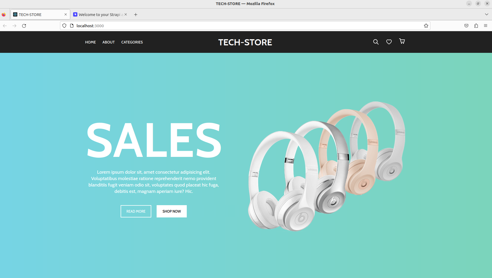
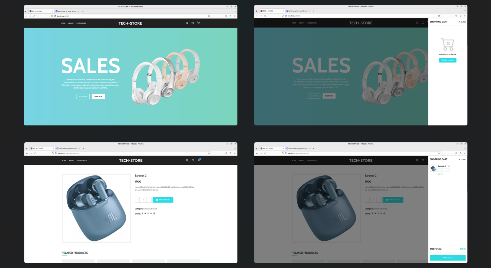
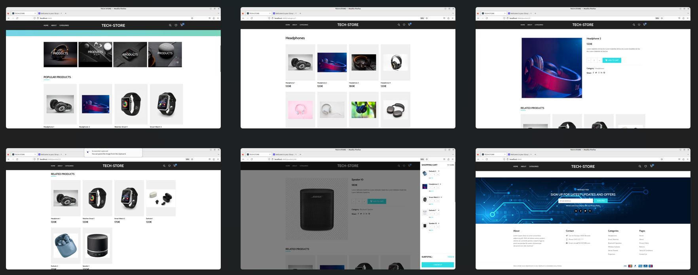
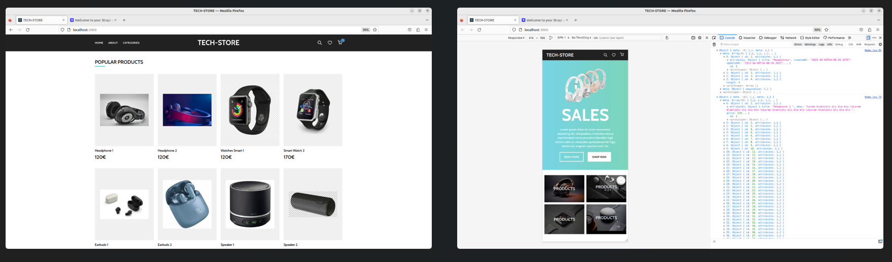

# E-commerce-v2 Project with ReactJS and Strapi

 

## Table of Contents

- [Overview](#overview)
- [Features](#features)
- [Prerequisites](#prerequisites)
- [Getting Started](#getting-started)
- [Project Structure](#project-structure)
- [Usage](#usage)
- [License](#license)

---

## Overview

This repository contains an E-Commerce project built with ReactJS for the frontend and Strapi for the backend. It allows users to browse and purchase items, add them to a cart, and complete the checkout process.
  
This project is responsive

**Screenshots: (more img inside the folder e-commerce-v2)** 

 
 
 

---

## Features

- Browse and search for items
- Add items to the shopping cart
- View and edit the contents of the cart
- Complete the checkout process
- Admin panel for managing products, orders, and users

---

## Prerequisites

Before you begin, ensure you have met the following requirements:

- Node.js and npm installed on your development environment.
- Strapi installed and configured for the backend.
- Clone this repository to your local machine.
-If you want to use the Strapi backend, you'll need to create your own administration and data.
---

## Getting Started

Follow these steps to get your project up and running:

1. **Install Dependencies:**
     npm install
2. **Configure Environment Variables:**
Create a .env file in the root of your project and add necessary environment variables like API URLs, API keys, etc.

3. **Start the Development Server:**
    npm start 
4. **Start Strapi:**
If you're using Strapi for the backend, make sure it's up and running. Refer to Strapi's documentation for details on starting the server.
5.**Access the Application:** 
Open your browser and visit http://localhost:3000 to access the application.

---

## Project structure 

- `/src`: Contains the source code for the ReactJS frontend.
  - `/components`: Reusable React components.
  - `/pages`: Individual page components.
  - `/styles`: SCSS/Sass stylesheets.
- `/backend`: Contains Strapi backend code.

---

## Usage

- Browsing Products: Browse through the available products by navigating different categories and using the search functionality.
- Adding Items to Cart: Click on a product to view details and add it to your shopping cart.
- Managing Cart: Access your shopping cart to view, edit, or remove items before proceeding to checkout.
- Checkout Process: Complete the checkout process, providing shipping and payment information as required.

---

## License

This project is licensed under the MIT License. 

